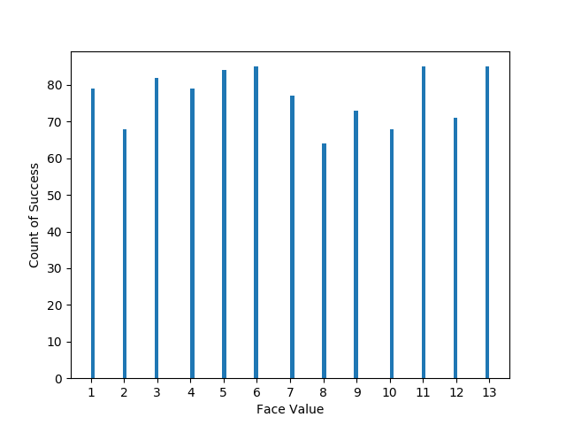
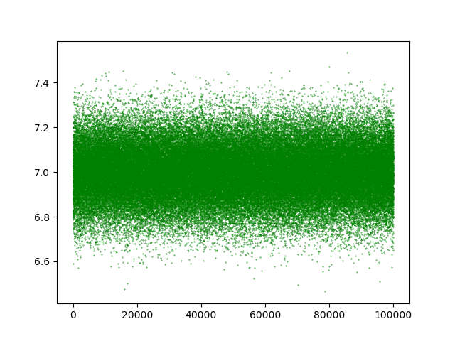
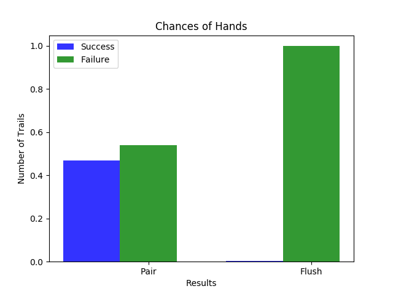
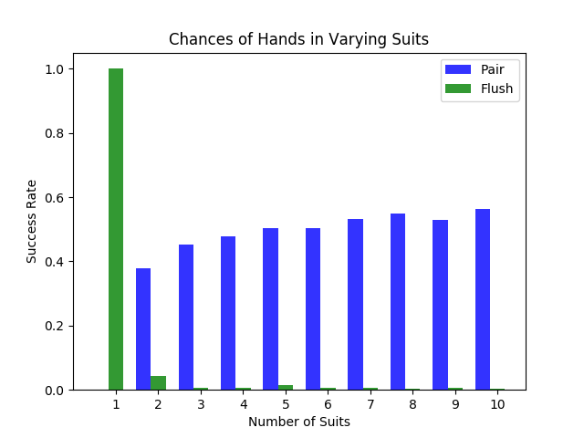

# Simulation on a Deck of Cards using Python

Though [writing a Freecell game in text form](https://github.com/YiAlpha/free-cell-python) with Python is the least serviceable project I have done with Python🤷🏻‍♀️. The *card* and *deck* objects are reusable for other serious purposes. Thanks to Object-Oriented (OO) programming, I have the excuse for why I wrote a Freecell game that only can be played in terminal 🤦🏻‍♀️

So, I will do some simulation and statistical analysis in this project to pretend I'm a data scientist (alas, the *Sexiest Job* of the 21st Century).

Or, maybe I can use this project along with my useless [text fortmat freecell](https://github.com/YiAlpha/free-cell-python) to construct a portfolio as a make-you-a-data-scientist consultant. I invented a job in the moment of  writing this README documentation, which can provide project ideas and computation solutions to help someone (my potential clients) show off that they are data scientists). If you are interested in claiming yourself as doing or being able to do *Sexiest Job* of the 21st Century but had headaches in coding, math, and technical writing, shoot me an email <a href="mailto:yiyinnyc@gmail.com?"></a>, I can offer you the services to free your hand and head LOL

## Proving Fairness

### Random draw 1000 times

To calculate the mean face value of repeated drawing from a deck of cards with replace, the first step is to implement a random draw from a deck of cards. Using the `deck` class I wrote for Freecell to initialize a standard deck of cards (4 suits, 13 cards in each suit), and get the face value of each card in that standard deck via `get_face_index()` in `card` class. 

To execute a random draw with replacement, I call `choices` function in `random` module. To repeat the random draw, just specify the parameter `k` in the `random.choices()` . The `random choice()` function returns a list of face value generated by each random draw. And then I call `mean` function from `numpy` module to calculate the mean face value of the 1000 random draw. After print the 1000 drawn card face value I get, `np.mean()` calculate the mean value is 7.045.

```python
# set seed to reproduce the randon draw result
random.seed(1005)
my_deck = Deck(1, 13, 4)
my_deck.shuffle()
# get face index for each card
face_list=[]
for i in range(52):
    face_list.append(my_deck.draw_card().get_face_index())
```

```python
# Random draw from a deck of cards 1000 times
sample_result =  random.choices(face_list, k=1000)
# Print the face value for 1000 drawn cards
transposedMatrix = np.transpose(sample_result)
print (transposedMatrix)
```

```python
# Mean face value of 1000 draw
print(np.mean(sample_result))

>>> 6.987
```

The plot below shows the number of occurrences for each face value. We can see that the numbers of occurrence of every value from 1 to13 are bounded by 60 and 85.




### Repeating the random trail containing 1000 draws

To obtain more sound prove for the mean value from 1000 times random draw, I repeat the same procedure (conduct 1000 random draw from a deck of card with replacement, and then calculate the mean face value from the 1000 drawn card) above 100, 000 times by writing a function `mean_test()`.

```python
# Write a function to repeat 1000 draws
# Set default to test 10-time repeat
def mean_test(meanTest_size = 10):
    meanTest_result = []
    for m in range(meanTest_size):
        test_deck = Deck(1, 13, 4)
        test_deck.shuffle()
        face_list = []
        for i in range(52):
            face_list.append(test_deck.draw_card().get_face_index())
        sample_result = random.choices(face_list, k=1000)

        newValue =  np.mean(sample_result)
        meanTest_result.append(newValue)
    return meanTest_result
```

```python
# repeat the experiment above 100 times, save every mean to the list
run_result = mean_test(100000)
```

Then I map each result on a plot to show the distribution of results from 100,000 times trails. We can see that most of the mean values obtained from one hundred thousand time trials fall into the $[6.5, 7.5]$ interval.



## Chances of Hands

### Frequency of pair from 1000 hand-draw

To calculate the frequency of pair from repeated hand-draw, I firstly write a function `is_pair()` to test whether there is a pair in hand. And then draw a hand of card from a randomly shuffled deck to test whether there is a pair.

```python
def is_pair(hand_list):
    '''
    Test whether there is a pair in the hand.
    :param hand_list: A hand draw from a random shuffled deck
    :return: True is there is a pair; False none of cards are pair.
    '''
    face_list = []
    for i in range(5):
        face_list.append(hand_list[i].get_face_index())
    # if
    if len(set(face_list)) < 5:
        return True
    else:
        return False
```

```python
 def pair_test():
    '''
    Draw a hand from a draw shuffled deck, and test whether there is a pair
    :return: if there is a pair, return 1, otherwise return 0.
    '''
    my_deck.shuffle()
    hand_list = []
    for i in range(5):
        hand_list.append(my_deck[i])
    if is_pair(hand_list) == True:
        return 1
    else:
        return 0
```

To obtain the frequency of pair occurrence, I repeat the procedure (draw a hand from a randomly shuffled deck, and then test whether there is a pair) 1000 times. The `pair_test()` result printed as $1$ if there is a pair in the drawn hand, $0$ otherwise.
$$
\text{Probability  of  getting  a pair} = \frac{\text{Number of pair occurance}}{\text{Total times of draw}}
$$

```python
def get_pair_rate(pairTest_size = 1000):
    '''
    draw a hand from a random shuffled deck n times,
    return the approximated probability of getting a pair
    :param pairTest_size: times of random draw
    :return: the approximated probability of getting a pair
    '''
    pairTest_result = []
    for i in range(pairTest_size):
        newValue = pair_test()
        pairTest_result.append(newValue)
    pair_rate = sum(pairTest_result) / pairTest_size
    transposedMatrix = np.transpose(pairTest_result)
    print (transposedMatrix)
    return pair_rate
```

```python
 print(get_pair_rate())

>>> 0.508
```


### Frequency of flush from 1000 hand-draw

To calculate the frequency of flush, following similar steps like calculating the probability of getting a pair above, but the function to test is `is_flush()` and `flush_test()` to check whether a hand is a flush. 

```python
def is_flush(hand_list):
     '''
     Test whether there is a flush in the hand.
     :param hand_list: A hand draw from a random shuffled deck
     :return: True is there is a flush; False otherwise.
     '''
    suit_list = []
    for i in range(5):
        suit_list.append(hand_list[i].get_suit_index())

    if len(set(suit_list)) == 1:
        return True
    else:
        return False
```

```python
def flush_test():
    '''
     Draw a hand from a draw shuffled deck, 
     and test whether there is a flush
     :return: if there is a flush, return 1, otherwise return 0.
     '''
    my_deck.shuffle()
    hand_list = []
    for i in range(5):
        hand_list.append(my_deck[i])
    if is_flush(hand_list) == True:
        return 1
    else:
        return 0
```

And I was then writing a function `get_flush_rate()` to draw 1000 hands with replacement from a deck of randomly shuffled cards and test each whether there is a flush. The `flush_test()` result printed as $1$ if there is a pair in the drawn hand, $0$ otherwise. Finally, calculate the frequency of flush occurrence to approximate the probability.
$$
\text{Probability  of  getting  a flush} = \frac{\text{Number of flush occurance}}{\text{Total times of draw}}
$$

```python
def get_flush_rate(flushTest_size = 1000):
    '''
     draw a hand from a random shuffled deck n times,
     return the approximated probability of getting a pair
     :param pairTest_size: times of random draw
     :return: the approximated probability of getting a pair
     '''
    flushTest_result = []
    for i in range(flushTest_size):
        newValue = flush_test()
        flushTest_result.append(newValue)
    flush_rate = sum(flushTest_result) / flushTest_size
    transposedMatrix = np.transpose(flushTest_result)
    print (transposedMatrix)
    return flush_rate
```

```python
print(get_flush_rate())

>>> 0.006
```

### Pair and flush frequency plot

To visualize the approximated probability of pair and flush occurrence, I plot 1000-time trails from `pair_test()` and `flush_test()` using a bar plot below. The blue bar is the rate of occurrence in 1000 random draws for pair and flush. Respectively, the green bar is the complement of its occurrence. The pair frequency shows on the left, and the flush frequency on the right.




## Change in Chance

### Calculate frequency varying the number of suits

Given the experiment in the last part, now we are varying the number of suits from 1 to 10 to see the change of chances of pair and flush. Therefore, I write to functions to run the *pair experiment* and *flush experiment*, respectively, the number of suits as a parameter to manipulate easily. 

```python
def change_pair_test(n_suits = 4, pairTest_size = 1000):
    '''
    :param n_suits: number of suits in the deck of cards
    :param pairTest_size: number of random draw of hands of cards
    :return: the frequency of pair occurrence
    '''
    change_pairTest_result = []
    for p in range(pairTest_size):
        the_deck = Deck(1, 13, n_suits)
        the_deck.shuffle()
        hand_list = []
        for i in range(5):
            hand_list.append(the_deck[i])

        newValue = is_pair(hand_list)
        change_pairTest_result.append(newValue)
    change_pair_rate = sum(change_pairTest_result) / pairTest_size
    return change_pair_rate
```

```python
# conduct change_pair_test varying number of suits from 1 to 10
pair_change = []
for i in range(10):
    newValue = change_pair_test(n_suits = i+1, pairTest_size = 1000)
    pair_change.append(newValue)
print(pair_change)

>>> [0.0, 0.379, 0.452, 0.477, 0.504, 0.503, 0.533, 0.549, 0.528, 0.564]
```

From 1 suit to 10 suits, the frequency of pair occurrence increase from 0 to 57.7%. Since in a single suit, each face value is unique, the chance of getting a pair is 0.

```python
def change_flush_test(n_suits = 4, flushTest_size = 1000):
    '''
      :param n_suits: number of suits in the deck of cards
      :param pairTest_size: number of random draw of hands of cards
      :return: the frequency of flush occurrence
      '''
    change_flushTest_result = []
    for p in range(flushTest_size):
        the_deck = Deck(1, 13, n_suits)
        the_deck.shuffle()
        hand_list = []
        for i in range(5):
            hand_list.append(the_deck[i])
        newValue = is_flush(hand_list)
        change_flushTest_result.append(newValue)
    change_flush_rate = sum(change_flushTest_result) / flushTest_size
    return change_flush_rate
```

```python
# conduct change_flush_test varying number of suits from 1 to 10
flush_change = []
for i in range(10):
    newValue = change_flush_test(n_suits = i+1, flushTest_size = 1000)
    flush_change.append(newValue)
print(flush_change)

>>> [1.0, 0.043, 0.007, 0.006, 0.015, 0.007, 0.005, 0.002, 0.006, 0.004]
```

From 1 suit to 10 suits, the frequency of flush occurrence drop from 1 to 0.1%. Since in a single suit, every card is the same suit, the chance of getting a flush is 1.

### Plot the frequency in various suits

Plot the results obtained from above via `matplotlib.pyplot`, we can see the chance of pair and flush occurrence when varying suits. The green bars show the possibilities of pair, and the blue bars show the chances of flush. The plot echoes with the data list I got in the last part.



